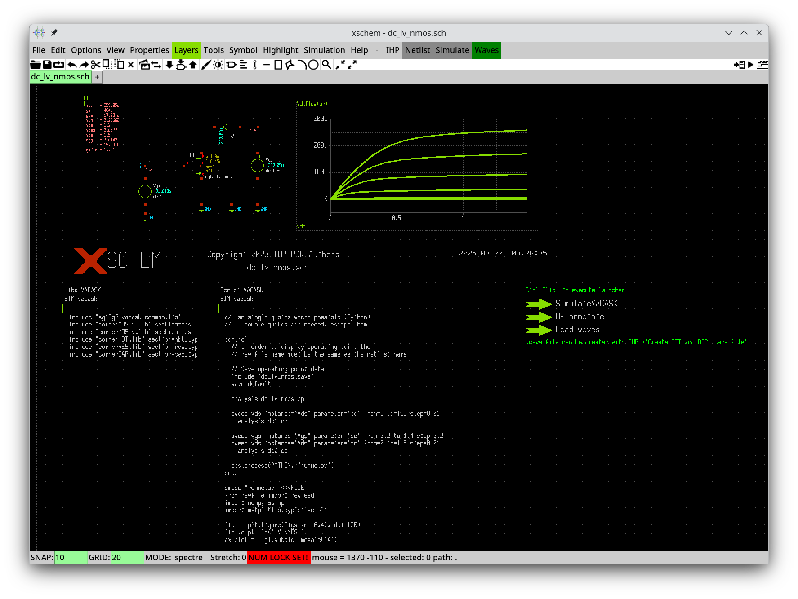
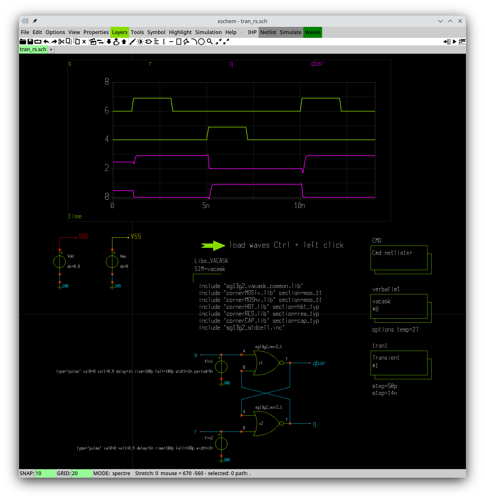

# Converting IHP Open PDK for use with VACASK

Conversion was tested on version 62c1d640dc1c91f57bc1a8e4e08e537a7a105ae8 of the IHP Open PDK (August 2025). It may or may not work with newer versions. First, clone IHP SG13G2 PDK
```
git clone https://github.com/IHP-GmbH/IHP-Open-PDK
```
Now you have the latest version of the PDK in a directory named `IHP-Open-PDK`. If conversion fails or the converted PDK does not work, you can try again with version 62c1d640dc1c91f57bc1a8e4e08e537a7a105ae8 by typing (immediately after checkout)
```
cd IHP-Open-PDK
git checkout 62c1d640dc1c91f57bc1a8e4e08e537a7a105ae8
```

Set environmental variables
* `PDK_ROOT` to the directory where you downloaded the PDK (e.g. `/home/myname/IHP-Open-PDK`) and
* `PDK` to `ihp-sg13g2`. 

You will need the path to VACASK's Python scripts. If you don't know where these scripts are, type
```
vacask -dp
```
and look for "Python path addition". Suppose the python path addition is `/usr/local/lib/vacask/python`. Type
```
PYTHONPATH=/usr/local/lib/vacask/python python3 -m sg13g2tovc
```

The converter will process the Ngspice models and 
* create directory `ihp-sg13g2/libs.tech/vacask/models` with the converted models
* create directory `ihp-sg13g2/libs.ref/sg13g2_stdcell/vacask` with the converted standard cells
* create directory `ihp-sg13g2/libs.ref/sg13g2_io/vacask` with the converted I/O cells
* create a VACASK config file `ihp-sg13g2/libs.tech/vacask/.vacaskrc.toml`
  (copy this file to the directory where your top level netlist is located)
* patch xschem symbols with the VACASK netlisting pattern (`sg13g2_pr` and `sg13g2_stdcells` directories)
* patch the Xschem configuration file `ihp-sg13g2/libs.tech/xschem/xschemrc`
* add a VACASK customization file for Xschem (`ihp-sg13g2/libs.tech/xschem/xschem-vacask`)
* compile the Verilog-A models that are provided with the PDK and place the 
  resulting .osdi files in `ihp-sg13g2/libs.tech/vacask/osdi`
* create an include file `ihp-sg13g2/libs.tech/vacask/models/sg13g2_vacask_common.lib`
  (always include this file along with all other PDK files)

Some examples and a [.vacaskrc.toml](.vacaskrc.toml) configuration file are available in this directory. Just set the `PDK_ROOT` and the `PDK` environmental variables and run examples with VACASK. The [.vacaskrc.toml](.vacaskrc.toml) file must be copied either to the user's home directory or to the directory where VACASK is started. 



# Using Xschem with the converted IHP Open PDK

First, read the section on [using Xschem with VACASK](../xschem/README.md). Next (if you still did not do it), apply the included converter to the IHP Open PDK (see the previous section). The converter patches all symbols provided by the PDK in the `ihp-sg13g2/libs.tech/xschem/sg13g2_pr` directory so that they can be used for creating VACASK netlists. 

Before you start Xschem make sure the `PDK_ROOT` and the `PDK` environmental variables are set. Set the `XSCHEM_NETLIST_TYPE` environmental variable to `spectre` and copy the Xschem configuration file [xschemrc](xschemrc) to the directory where you intend to start Xschem. This file will chain-load the IHP PDK's Xschem configuration file. The latter loads IHP PDK's Xschem extensions and symbols at startup. Now you can start Xschem. 

For VACASK simulations to work when invoked from Xschem you will have to copy the [.vacaskrc.toml](.vacaskrc.toml) file to the user's home directory. Netlists will be created and VACASK will be started in the `simulations` subdirectory of the directory where Xschem was started. 

Three simple examples are provided. The first example [dc_lv_nmos.sch](dc_lv_nmos.sch) is an analog circuit. The generated netlist contains a control block that performs an operating point analysis, a 1D operating point Sweep, and a 2D operating point sweep. The 2D sweep is plotted by the embedded Python script. By holding the Control button and left-clicking the `SimulateVACASK` launcher you can start the simulation. The operating point results can be loaded with the `Op annotate` launcher and the results of the dc2 analysis can be plotted in the embedded graph with the `Load waves` launcher. 

The second example [tran_inv.sch](tran_inv.sch) demonstrates the operationm of a simple inverter from the `sg13g2_stdcells` library. When simulating circuits that comprise components from this library make sure to define the potentials¸ of nodes `VDD` and `VSS` (i.e. connect a voltage source with the corresponding DC value to each of the two nodes). 

The third example simulates a RS latch. This example uses the analyses Xschem library for setting up the analyses. 



Currently HBT operating point backannotation does not work because VACASK uses the Verilog-A version of the VBIC model which does not expose operating point data. Once the VBIC model is converted from Ngspice to Verilog-A this feature will be added. 
