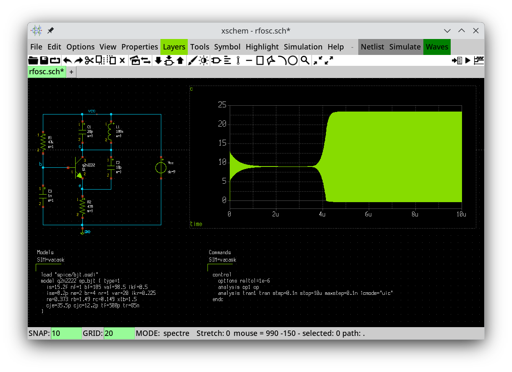
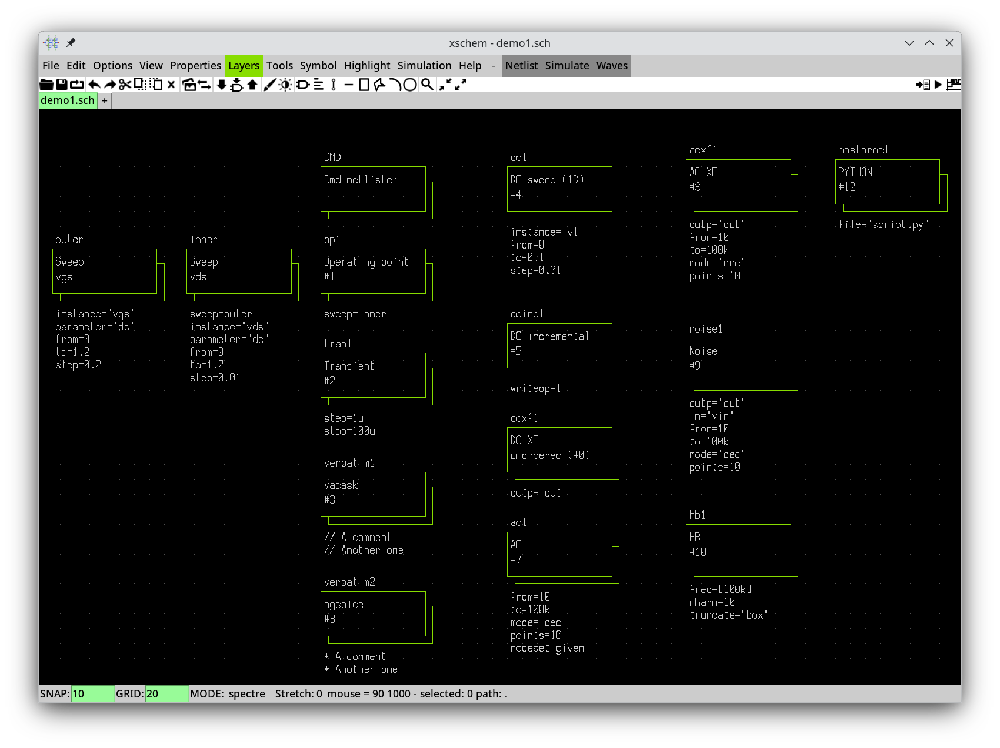

# Using Xschem with VACASK

Download the latest Xschem sources from [https://github.com/StefanSchippers/xschem](https://github.com/StefanSchippers/xschem). Most packages available in various Linux distributions lack VACASK support because they are too old. Build and install Xschem (by default it will be installed in /usr/local). 
```
git clone https://github.com/StefanSchippers/xschem
cd xschem
./configure
make
sudo make install
```

The following symbols from the devices library support VACASK: 
|Symbols    |Comment         |
|-----------|----------------|
|vsource, isource, sqwsource | |
|diode, zener                | |
|vcvs, vccs                  | |
|cccs, ccvs                  |quote `vnam` value, escape quotes (e.g. `vnam=\"vctl\"`) |
|res, capa, capa-2, ind      | |
|k                           |quote `L1` and `L2` value, escape quotes |
|npn, pnp, njfet, pjfet      | |
|nmos, pmos                  | |
|nmos3, pmos3                |uses `m` instead of `$mfactor` (assumes device is a subcircuit)|
|nmos4, pmos4                | |
|nmos-sub, pmos-sub          | |
|nmos4_depl                  | |
|pmoshv4, pmosnat            |uses `number` instead of `$mfactor` (assumes device is a subcircuit)|
|code, code_shown            | |
|netlist, netlist_not_shown  | |
|netlist_at_end              | |
|netlist_not_shown_at_end    | |
|simulator_commands          |set `simulator` to `vacask` |
|simulator_commands_shown    |set `simulator` to `vacask` |
|param                       | |

To make a symbol VACASK compatible set the `spectre_format` attribute in the .sym file. The `spectre_device_model` attribute specifies the VACASK netlist commands that will be included in the netlist once for that particular type of element (i.e. `load` and `model` commands for fundamental elements, like independent sources, controlled sources, and passives). Before creating a netlist, select the `spectre` netlist mode in the `Options/Netlist format` menu. 

An Xschem configuration file ([xschemrc](xschemrc)) is provided that sets the correct netlist type, configures the directory for storing the netlists and running simulations, and sets up the external editor. VACASK must be in the system path if you want to run simulations from Xschem. 

VACASK rawfiles always contain a single plot. When loading raw files with the `xschem raw_read <rawfile.raw> <analysis type>` command do not specify the analysis type. This way Xschem will load the first plot from the rawfile and will not try to match the `Plotname:` field in the file. The same can be achieved by selecting the `Waves/Load first analysis found` option from the main menu, as well as, by clicking the `View results` icon. 

A simple example is provided ([rfosc.sch](rfosc.sch)). After you open it, select `Netlist` from the main menu, followed by `Simulate`. When the simulation is finished select `Waves/Load first analysis found` in the main menu and choose file `tran1.raw`. The circuit's response will be plotted in the embedded graph. 


# Setting up analyses with visual components (like in Qucs)



The analyses library in Xschem provides a set of blocks that can be used to visually set up the analyses and other control block commands. If you want to use this feature place a `command_block.sym` component in your schematic. To invoke an operating point analysis place the `op.sym` component. For an ac analysis one has to place the `ac.sym` component. Analysis parameters are set via the symbol's attributes. The `order` attribute is a number which specifies the order in which the compinents will be netlisted as commands in the control block. Components with a lower `order` attribute value are netlisted before components with a higher attribute value. Note that attributes which will be netlisted as VACASK strings must be quoted, i.e. given as `\"<string>\"`. 

Sweeping is performed by placing a `sweep.sym` component. This component specifies one level of sweeping. Its `name` attribute value must be specified as the `sweep` attribute value of the analysis you want to sweep. The `sweep.sym` component has a `sweep` attribute itself which makes it possible to chain sweeps and create multidimensional sweeps. The `tag` attribute is used as the name of the sweep variable and gets netlisted as 
```
sweep <tag> ...
```

The `dc1d.sym` component adds a 1-dimensional operating point sweep to the control block. It exposes all attributes of `op.sym` and `sweep.sym` and is useful for quickly setting up 1-dimensional DC sweeps. You can apply a sweep chain to it by setting its `sweep` attribute which results in higher-dimensional sweeps. 

The `verbatim.sym` component adds a verbatim text to the control block. The `postproc.sym` component adds a `postprocess` command to the control block. 

An example of how to use these components can be found in file `analyses.sch`. 


