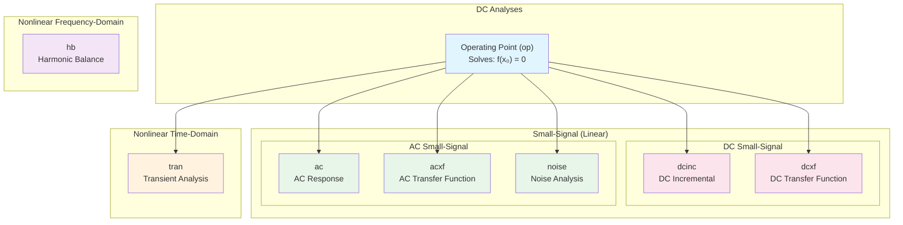
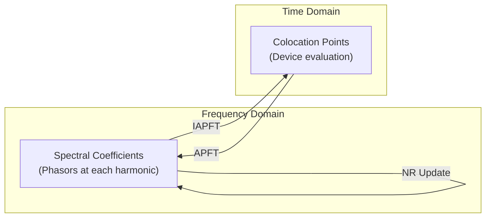
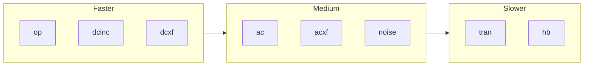

# VACASK Analysis Types

This document provides an overview of all analysis types supported by VACASK.

## Summary

| Analysis | Command | Description |
|----------|---------|-------------|
| **op** | `op` | Operating Point (DC bias point) |
| **tran** | `tran` | Transient (time-domain) |
| **ac** | `ac` | AC small-signal frequency response |
| **noise** | `noise` | Small-signal noise analysis |
| **hb** | `hb` | Harmonic Balance (steady-state periodic) |
| **dcinc** | `dcinc` | DC incremental (small-signal at DC) |
| **dcxf** | `dcxf` | DC transfer function |
| **acxf** | `acxf` | AC transfer function |

## Analysis Hierarchy



## Circuit Equations

All analyses work with the fundamental circuit DAE:

```
f(x(t)) + d/dt q(x(t)) = 0
```

Where:
- `x(t)` — circuit unknowns (node voltages, branch currents)
- `f(x)` — resistive residual (conductance contributions)
- `q(x)` — reactive residual (charge/flux contributions)

---

## 1. Operating Point (`op`)

**Purpose**: Find the DC steady-state solution.

**Equation**: `f(x₀) = 0`

**Method**: Newton-Raphson iteration with the resistive Jacobian.

**Output**: Node voltages and branch currents at the quiescent point.

**Usage**:
```
op myop ()
```

**Parameters**:

| Parameter | Description |
|-----------|-------------|
| `nodeset` | Initial guess for node voltages |
| `store` | Name to save solution for later use |
| `write` | Enable/disable output file |

See [operating_point.md](operating_point.md) for detailed algorithm description.

---

## 2. Transient (`tran`)

**Purpose**: Time-domain simulation of circuit dynamics.

**Equation**: `f(x) + dq/dt = 0` integrated over time.

**Method**: Variable-order implicit integration (Adams-Moulton or BDF) with adaptive timestep control and Newton-Raphson at each timepoint.

**Output**: Waveforms of voltages and currents vs. time.

**Usage**:
```
tran mytran (stop=1u, step=1n)
```

**Parameters**:

| Parameter | Description |
|-----------|-------------|
| `step` | Output/initial timestep |
| `stop` | Simulation end time |
| `start` | Time to begin recording output |
| `maxstep` | Maximum allowed timestep |
| `icmode` | Initial condition mode: `op` or `uic` |
| `ic` | Initial conditions specification |

See [transient.md](transient.md) for detailed algorithm description.

---

## 3. AC Small-Signal (`ac`)

**Purpose**: Compute frequency response around the operating point.

**Equation**: `(Jr + jωJc) X = U`

Where:
- `Jr` — resistive Jacobian at operating point
- `Jc` — reactive Jacobian at operating point
- `ω = 2πf` — angular frequency
- `U` — AC excitation phasors (from source `mag` and `phase` parameters)
- `X` — response phasors

**Method**:
1. Solve operating point
2. Compute linearized Jacobians
3. For each frequency, solve complex linear system

**Output**: Complex phasors for all node voltages and branch currents.

**Usage**:
```
ac myac (from=1, to=1G, points=100, mode=dec)
```

**Parameters**:

| Parameter | Description |
|-----------|-------------|
| `from` | Start frequency |
| `to` | Stop frequency |
| `step` | Frequency step (linear sweep) |
| `mode` | Sweep mode: `lin`, `dec`, `oct` |
| `points` | Number of points (per decade/octave for log) |
| `values` | Explicit frequency list |

---

## 4. Noise (`noise`)

**Purpose**: Compute output noise spectral density from all noise sources.

**Method**:
1. Solve operating point
2. For each frequency:
   - For each noise source, solve `(Jr + jωJc) X = U` with unit excitation
   - Compute contribution to output power spectral density
3. Also compute gain from input source to output

**Output**:
- Individual noise source contributions (V²/Hz or A²/Hz)
- Per-instance total noise
- Total output noise spectral density
- Power gain from input to output
- Equivalent input noise

**Usage**:
```
noise mynoise (out="vout", in=vin, from=1, to=1G, points=100, mode=dec)
```

**Parameters**:

| Parameter | Description |
|-----------|-------------|
| `out` | Output node or node pair |
| `in` | Input source name |
| `from`, `to`, `mode`, `points` | Frequency sweep (same as AC) |

---

## 5. Harmonic Balance (`hb`)

**Purpose**: Find the periodic steady-state for circuits with multiple excitation tones.

**Method**:
- Solve in the frequency domain
- Newton-Raphson on spectral coefficients
- Almost-Periodic Fourier Transform (APFT) between time and frequency domains
- Colocation in time domain for nonlinear device evaluation



**Features**:
- Multiple fundamental frequencies (multi-tone)
- Box or diamond truncation for harmonic selection
- Intermodulation product handling
- Oversampling in time domain

**Usage**:
```
hb myhb (freq=[1M, 1.01M], nharm=7, truncate=diamond)
```

**Parameters**:

| Parameter | Description |
|-----------|-------------|
| `freq` | Fundamental frequencies |
| `nharm` | Number of harmonics per fundamental |
| `immax` | Maximum intermodulation order |
| `truncate` | Truncation scheme: `box`, `diamond`, `raw` |
| `samplefac` | Time-domain oversampling factor |

---

## 6. DC Incremental (`dcinc`)

**Purpose**: Small-signal response at DC (ω=0).

**Equation**: `Jr · dx = du`

Where `du` contains incremental excitations from source `mag` parameters.

**Method**:
1. Solve operating point
2. Compute resistive Jacobian
3. Solve linear system with combined excitation

**Output**: Incremental changes in all node voltages and branch currents.

**Usage**:
```
dcinc mydcinc ()
```

---

## 7. DC Transfer Function (`dcxf`)

**Purpose**: Compute DC transfer functions from all sources to a specified output.

**Equation**: `Jr · dx = du` (solved for each source with unit excitation)

**Output** (for each independent source):
- Transfer function to output node(s)
- Input impedance (Zin)
- Input admittance (Yin)

**Usage**:
```
dcxf mydcxf (out="vout")
```

**Parameters**:

| Parameter | Description |
|-----------|-------------|
| `out` | Output node or node pair |

---

## 8. AC Transfer Function (`acxf`)

**Purpose**: Compute AC transfer functions from all sources to a specified output across frequency.

**Equation**: `(Jr + jωJc) X = U` (solved for each source with unit phasor excitation)

**Output** (for each source, at each frequency):
- Complex transfer function to output
- Complex input impedance
- Complex input admittance

**Usage**:
```
acxf myacxf (out="vout", from=1, to=1G, points=100, mode=dec)
```

**Parameters**:

| Parameter | Description |
|-----------|-------------|
| `out` | Output node or node pair |
| `from`, `to`, `mode`, `points` | Frequency sweep (same as AC) |

---

## Comparison

### When to Use Each Analysis

| Goal | Analysis |
|------|----------|
| Find DC bias point | `op` |
| Time-domain waveforms | `tran` |
| Frequency response (Bode plot) | `ac` |
| Noise figure, noise contributors | `noise` |
| Steady-state with RF signals | `hb` |
| DC gain | `dcinc` or `dcxf` |
| Input/output impedance at DC | `dcxf` |
| Input/output impedance vs frequency | `acxf` |

### Computational Complexity



- **op, dcinc, dcxf**: Single linear solve (fast)
- **ac, acxf, noise**: Linear solve per frequency point
- **tran**: Nonlinear solve per timestep (many timesteps)
- **hb**: Large nonlinear system in frequency domain

---

## Source Files

| Analysis | High-Level | Core Implementation |
|----------|------------|---------------------|
| op | `lib/anop.cpp` | `lib/coreop.cpp` |
| tran | `lib/antran.cpp` | `lib/coretran.cpp` |
| ac | `lib/anac.cpp` | `lib/coreac.cpp` |
| noise | `lib/annoise.cpp` | `lib/corenoise.cpp` |
| hb | `lib/anhb.cpp` | `lib/corehb.cpp` |
| dcinc | `lib/andcinc.cpp` | `lib/coredcinc.cpp` |
| dcxf | `lib/andcxf.cpp` | `lib/coredcxf.cpp` |
| acxf | `lib/anacxf.cpp` | `lib/coreacxf.cpp` |
