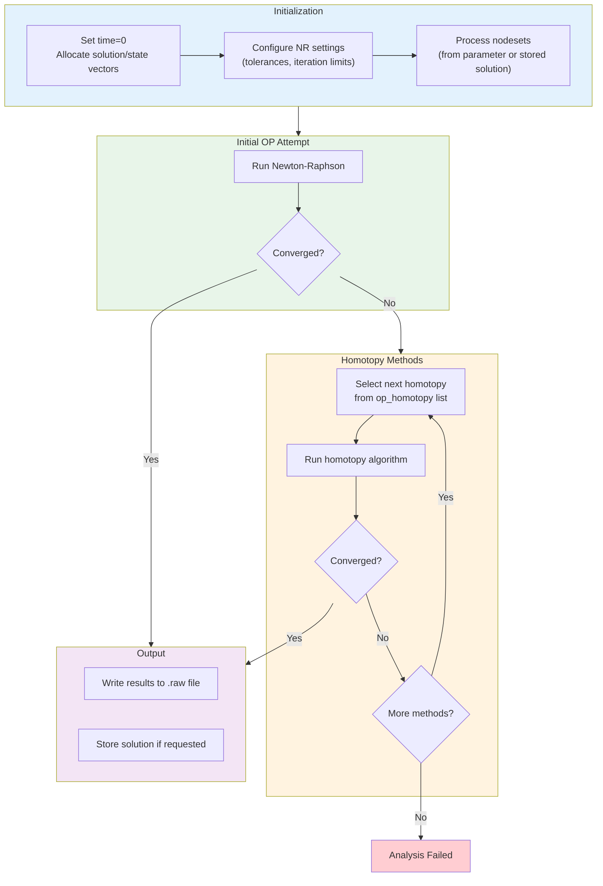
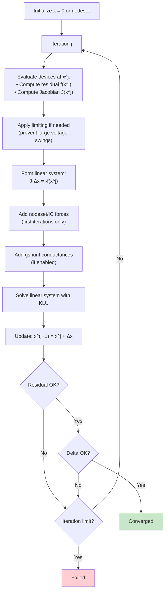
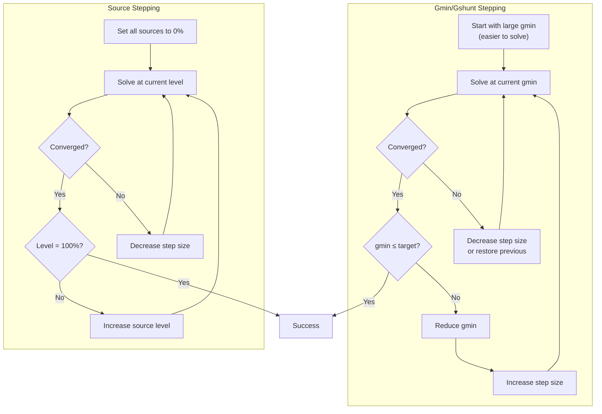
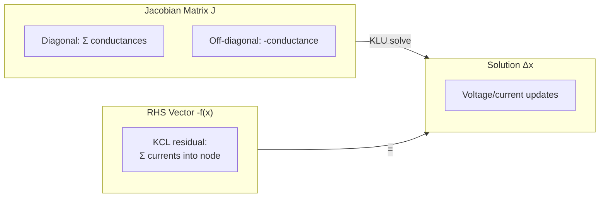
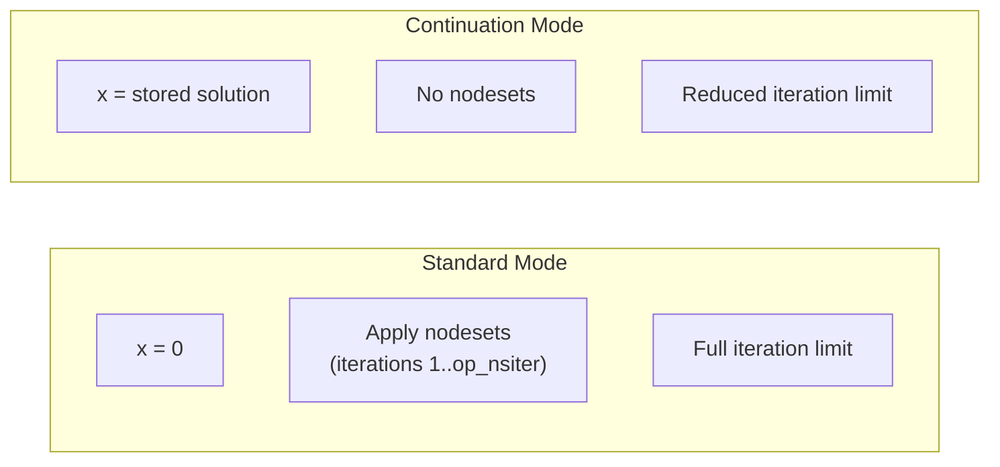
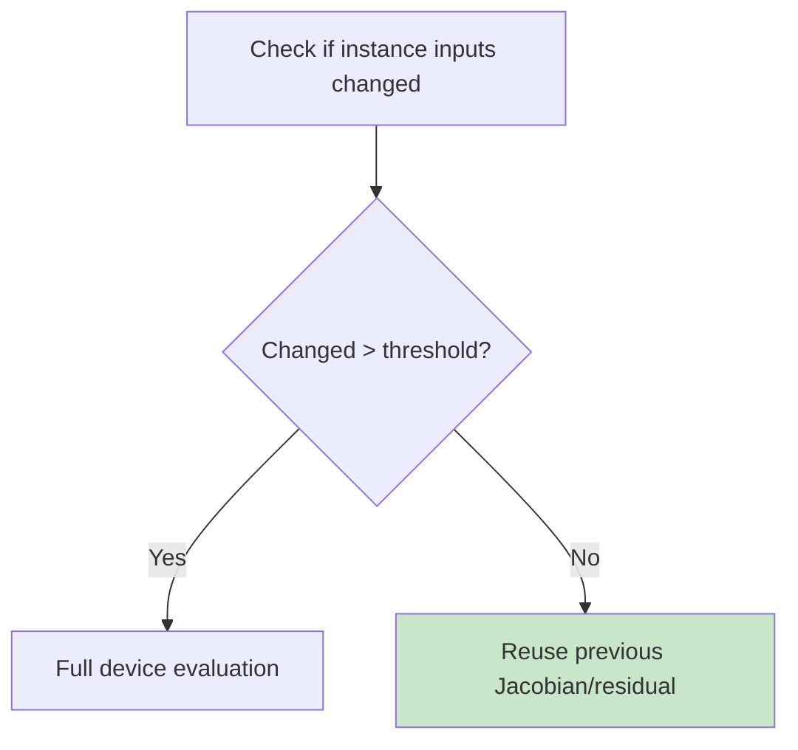

# VACASK Operating Point Analysis

This document describes the steps VACASK takes when performing operating point (DC bias) analysis.

## Overview

Operating point analysis finds the DC steady-state solution of the circuit by solving:

```
f(x) = 0
```

Where:
- `x` — circuit unknowns (node voltages, branch currents)
- `f(x)` — resistive residual (sum of currents at each node must be zero)

This is the foundation for all other analyses. Small-signal analyses (AC, noise, transfer functions) linearize around this operating point, and transient analysis uses it as the initial condition.

## Key Classes

| Class | File | Description |
|-------|------|-------------|
| `OperatingPoint` | `lib/anop.cpp` | High-level analysis wrapper |
| `OperatingPointCore` | `lib/coreop.cpp` | Core OP algorithm with homotopy |
| `OpNRSolver` | `lib/coreopnr.cpp` | Newton-Raphson solver for OP |
| `NRSolver` | `lib/nrsolver.cpp` | Base Newton-Raphson implementation |
| `Homotopy` | `lib/homotopy.cpp` | Base class for convergence aids |
| `GminStepping` | `lib/hmtpgmin.cpp` | Gmin/Gshunt stepping homotopy |
| `SourceStepping` | `lib/hmtpsrc.cpp` | Source stepping homotopy |

## Analysis Parameters

Defined in `OperatingPointParameters` (`include/coreop.h:37-45`):

| Parameter | Default | Description |
|-----------|---------|-------------|
| `nodeset` | "" | Initial guess: solution name or list of node values |
| `store` | "" | Name to store converged solution |
| `write` | 1 | Whether to write output file |

## High-Level Algorithm Flow



## Step-by-Step Algorithm

### Phase 1: Initialization

#### 1.1 Validate and Setup
Location: `coreop.cpp:407-424`

1. Set simulation time to 0
2. Allocate solution and state vectors (with bucket at index 0)
3. Configure Newton-Raphson settings from simulator options

#### 1.2 Process Nodesets
Location: `coreop.cpp:204-279`

Nodesets provide initial guesses to help convergence:

**From stored solution** (string parameter):
```
op myop (nodeset="previous_solution")
```
- Retrieve named solution from repository
- Apply as forced values in first iterations

**From explicit list** (value vector parameter):
```
op myop (nodeset=["vdd", 1.8, "vout", 0.9])
```
- Single node: `["node", value]`
- Node pair (differential): `["node1", "node2", value]`

#### 1.3 Bind Matrix Entries
Location: `coreop.cpp:204-209`

- Bind resistive Jacobian entries to KLU matrix
- Reactive entries not bound (OP is DC analysis)

### Phase 2: Newton-Raphson Solver

#### 2.1 NR Algorithm Overview



#### 2.2 Device Evaluation
Location: `coreopnr.cpp:636-668`

For each device instance:
1. **Evaluate** at current solution point
2. **Apply limiting** if voltage changes are too large (prevent numerical overflow)
3. **Compute Jacobian** contributions (∂I/∂V for each terminal pair)
4. **Compute residual** contributions (current into each terminal)

The `EvalSetup` structure controls evaluation:
```cpp
EvalSetup {
    .staticAnalysis = true,
    .dcAnalysis = true,
    .enableLimiting = true,
    .evaluateResistiveJacobian = true,
    .evaluateResistiveResidual = true,
}
```

#### 2.3 Nodeset Forces
Location: `coreopnr.cpp:781-863`

During early iterations (`iteration ≤ op_nsiter`), nodesets add penalty terms:

For a nodeset `v(node) = value`:
- **Jacobian**: Add `factor` to diagonal entry
- **Residual**: Add `factor × (v_node - value)`

Where `factor = rowNorm × nr_force` scales the penalty relative to existing entries.

This "soft" forcing gradually guides the solution toward the nodeset values.

#### 2.4 Convergence Checking
Location: `coreopnr.cpp:865-1059`

Two convergence criteria must be satisfied:

**Residual check** (`coreopnr.cpp:865-964`):
```
|f_i(x)| ≤ max(reltol × refval, abstol_i)
```
Where `refval` depends on `relrefres` option (local, global, etc.)

**Delta check** (`coreopnr.cpp:966-1059`):
```
|Δx_i| ≤ max(reltol × refval, abstol_i)
```
Where `refval` depends on `relrefsol` option.

Both checks must pass, and limiting must not have been applied.

### Phase 3: Homotopy Methods

When initial NR fails, VACASK tries homotopy methods to aid convergence.



#### 3.1 Homotopy Selection
Location: `coreop.cpp:444-499`

The `op_homotopy` option specifies which methods to try and in what order:

| Method | Description |
|--------|-------------|
| `gdev` | Add conductance across device terminals, step down |
| `gshunt` | Add conductance to ground at each node, step down |
| `spice3Gmin` | SPICE3-style gshunt stepping (fixed schedule) |
| `src` | Ramp independent sources from 0% to 100% |
| `spice3Src` | SPICE3-style source stepping |

Default order: `[gdev, gshunt, src]`

#### 3.2 Gmin Stepping
Location: `hmtpgmin.cpp:11-183`

**Concept**: Add small conductances to make the circuit easier to solve, then gradually reduce them.

1. Start with large gmin (e.g., 1e-3 S)
2. Solve the modified circuit
3. If converged: reduce gmin by factor, continue from previous solution
4. If failed:
   - If no good solution yet: increase gmin
   - Otherwise: restore last good solution, reduce step size
5. Repeat until gmin reaches target (typically gmin option or gmin/10)
6. Final solve with original circuit

**Adaptive stepping**: Factor adjusts based on iteration count:
- Few iterations → increase factor (take bigger steps)
- Many iterations → decrease factor (take smaller steps)

#### 3.3 Source Stepping
Location: `hmtpsrc.cpp`

**Concept**: Gradually ramp source values from 0 to 100%.

1. Set all independent sources to 0%
2. Solve (should be easy - no excitation)
3. Increase source level
4. Solve, using previous solution as initial guess
5. If failed: reduce step size, retry
6. Repeat until sources at 100%

### Phase 4: Output

#### 4.1 Write Results
Location: `coreop.cpp:507-510`

If converged and `write=1`:
- Write node voltages and branch currents to `.raw` file

#### 4.2 Store Solution
Location: `coreop.cpp:103-108`

If converged and `store` parameter given:
- Save solution to repository for later use (e.g., as nodeset for another analysis)

## Newton-Raphson Equation Details

### Linearized System

The nonlinear system `f(x) = 0` is solved iteratively:

```
f(x^j) + J(x^j) · (x^(j+1) - x^j) ≈ 0
```

Rearranging:
```
J(x^j) · Δx = -f(x^j)
x^(j+1) = x^j + Δx
```

Where:
- `J(x) = ∂f/∂x` is the Jacobian matrix
- `Δx = x^(j+1) - x^j` is the solution update

### With Limiting

When device limiting is applied (large voltage swings clamped):

```
J(x_lim) · (x^j - x^(j+1)) = f(x_lim) + J(x_lim) · (x^j - x_lim)
```

This prevents numerical issues from exponential device equations.

### Matrix Structure



## Continuation Modes

### Standard Mode (continuePrevious=false)
- Start from zero solution
- Apply user nodesets in first `op_nsiter` iterations
- Full NR iteration limit: `op_itl`

### Continuation Mode (continuePrevious=true)
- Start from stored/previous solution
- Skip nodesets (already at a good point)
- Reduced iteration limit: `op_itlcont`



## Force Slots

The solver maintains multiple force slots for different purposes:

| Slot | Purpose | When Active |
|------|---------|-------------|
| 0 | Sweep continuation / homotopy | During parameter sweeps, homotopy |
| 1 | User-specified nodesets | Iterations 1..op_nsiter when not continuing |
| 2 | Initial conditions (transient) | When called from tran with `icmode=op` |

## Simulator Options Affecting OP

| Option | Description |
|--------|-------------|
| `op_itl` | NR iteration limit (standard mode) |
| `op_itlcont` | NR iteration limit (continuation mode) |
| `op_nsiter` | Iterations to apply nodesets |
| `op_skipinitial` | Skip initial OP, go straight to homotopy |
| `op_homotopy` | List of homotopy methods to try |
| `op_debug` | Debug output level |
| `nr_damping` | Damping factor for solution updates |
| `nr_force` | Scale factor for nodeset penalty |
| `nr_bypass` | Enable inactive element bypass |
| `nr_residualcheck` | Enable residual convergence check |
| `reltol` | Relative tolerance |
| `relref` | Reference for relative tolerance |
| `gmin` | Minimum conductance (always present) |
| `gshunt` | Shunt conductance to ground |

## Homotopy Options

| Option | Description |
|--------|-------------|
| `homotopy_debug` | Homotopy debug output level |
| `homotopy_gminsteps` | Maximum gmin stepping iterations |
| `homotopy_gminfactor` | Gmin reduction factor per step |
| `homotopy_startgmin` | Initial gmin value |
| `homotopy_maxgmin` | Maximum gmin before giving up |
| `homotopy_mingmin` | Target minimum gmin |
| `homotopy_srcsteps` | Maximum source stepping iterations |

## Bypass Optimization

When `nr_bypass=1`, instances that haven't changed significantly can skip re-evaluation:



This significantly speeds up convergence when only part of the circuit is active.

## Error Conditions

| Error | Cause |
|-------|-------|
| `InitialOp` | Initial NR failed, trying homotopy |
| `Homotopy` | All homotopy methods failed |
| `NoAlgorithm` | No algorithm tried (op_skipinitial with empty homotopy list) |
| `ConflictNode` | Conflicting nodeset values for same node |
| `ConflictDelta` | Delta force conflicts with node forces |

## References

- `lib/coreop.cpp` — Operating point core implementation
- `lib/coreopnr.cpp` — OP Newton-Raphson solver
- `lib/nrsolver.cpp` — Base NR solver
- `lib/hmtpgmin.cpp` — Gmin stepping homotopy
- `lib/hmtpsrc.cpp` — Source stepping homotopy
- `include/coreop.h` — OperatingPointCore class
- `include/coreopnr.h` — OpNRSolver class
- `include/homotopy.h` — Homotopy base class
