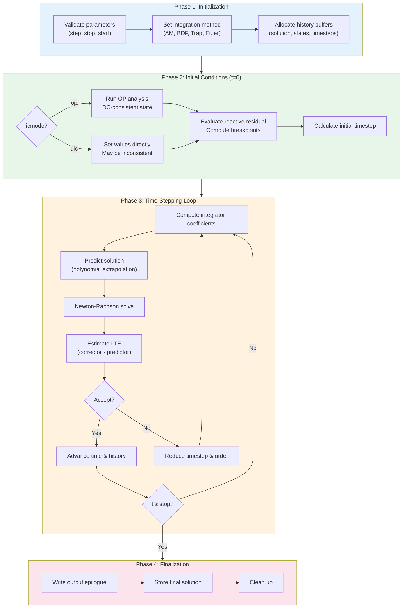
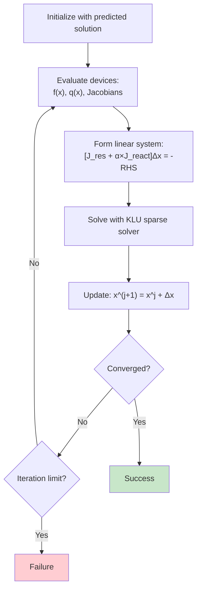
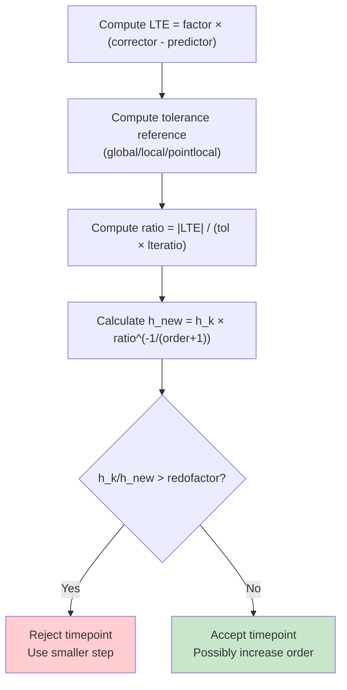
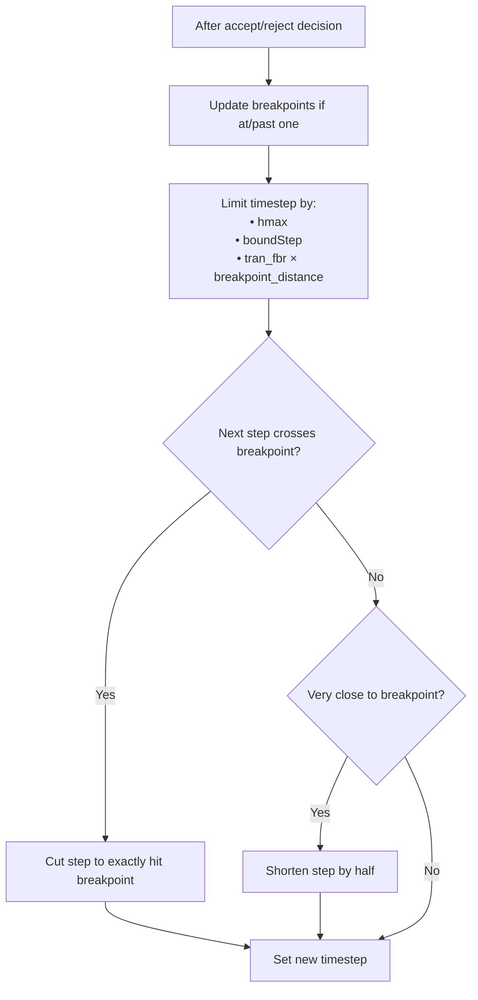
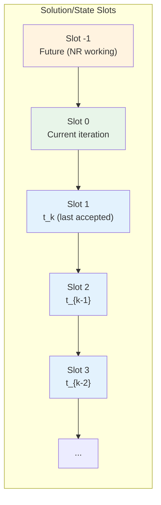

# VACASK Transient Analysis

This document describes the steps VACASK takes when performing transient (time-domain) analysis.

## Overview

Transient analysis solves the circuit's differential-algebraic equations (DAE) over time:

```
f(x(t)) + d/dt q(x(t)) = 0
```

Where:
- `x(t)` — circuit unknowns (node voltages, branch currents)
- `f(x)` — resistive residual (conductance contributions)
- `q(x)` — reactive residual (charge/flux contributions)

## Key Classes

| Class | File | Description |
|-------|------|-------------|
| `Tran` | `lib/antran.cpp` | High-level analysis wrapper |
| `TranCore` | `lib/coretran.cpp` | Core transient algorithm |
| `TranNRSolver` | `lib/coretrannr.cpp` | Newton-Raphson solver for transient |
| `IntegratorCoeffs` | `lib/coretrancoef.cpp` | Integration formula coefficients |
| `OperatingPointCore` | `lib/coreop.cpp` | Operating point for initial conditions |

## Analysis Parameters

Defined in `TranParameters` (`include/coretran.h:40-56`):

| Parameter | Default | Description |
|-----------|---------|-------------|
| `step` | 0.0 | Initial/output timestep |
| `stop` | 0.0 | Simulation end time |
| `start` | 0.0 | Time at which output recording begins |
| `maxstep` | 0.0 | Maximum timestep (0 = unlimited) |
| `icmode` | "op" | Initial condition mode: `op` or `uic` |
| `ic` | "" | Initial conditions (solution name or list) |
| `store` | "" | Name to store final solution |
| `write` | 1 | Whether to write output file |

## High-Level Data Flow



## Step-by-Step Algorithm

### Phase 1: Initialization

#### 1.1 Parameter Validation
Location: `coretran.cpp:559-573`

- Verify `step > 0`
- Verify `stop > 0`
- Verify `start < stop`

#### 1.2 Integration Method Setup
Location: `coretran.cpp:576-595`

VACASK supports multiple integration methods configured via `tran_method` option:

| Method ID | Description | Max Order |
|-----------|-------------|-----------|
| `am` | Adams-Moulton (general) | configurable |
| `bdf` / `gear` | Backward Differentiation Formula | configurable |
| `euler` | Backward Euler | 1 |
| `trap` | Trapezoidal | 2 |
| `bdf2` / `gear2` | BDF order 2 | 2 |

The integration method determines how the time derivative `dq/dt` is approximated.

#### 1.3 History Buffer Allocation
Location: `coretran.cpp:604-626`

Three history buffers are allocated:

1. **Solution history** — past circuit solutions for the predictor
2. **State history** — past reactive states (charges/fluxes) for the integrator
3. **Filtered solution** (optional) — for trapezoidal ringing filter

Also allocated:
- Predicted solution vector
- Scaled LTE (Local Truncation Error) vector
- Past timesteps circular buffer
- Breakpoint circular buffer

### Phase 2: Initial Conditions

#### 2.1 Operating Point Mode (`icmode="op"`)
Location: `coretran.cpp:636-651`

1. Enable IC forces in OP solver (slot 2)
2. Run full operating point analysis at t=0
3. This establishes a DC-consistent initial state

#### 2.2 UIC Mode (`icmode="uic"`)
Location: `coretran.cpp:652-673`

1. Set initial values directly from user-specified conditions
2. Skip operating point analysis
3. May result in inconsistent initial state (like SPICE3 `uic`)

#### 2.3 Initial State Evaluation
Location: `coretran.cpp:688-721`

After initial solution:
1. Compute reactive residuals (`q` values)
2. Compute initial breakpoints from sources
3. Compute maximum frequency in circuit
4. Store reactive state in history

#### 2.4 Initial Timestep Calculation
Location: `coretran.cpp:771-800`

The initial timestep `h0` is the minimum of:
- User-specified `step` parameter
- User-specified `maxstep` parameter
- Frequency-based limit: `tran_ffmax / (2 × maxFreq)`
- Breakpoint fraction: `tran_fbr × (next_breakpoint - t0)`
- Instance-requested `boundStep`
- Scaled by `tran_fs` factor

### Phase 3: Time-Stepping Loop

The main loop (`coretran.cpp:848-1459`) advances time from t=0 to t=stop.

#### 3.1 Coefficient Computation
Location: `coretran.cpp:867-879`

For each timestep:

1. **Predictor coefficients** — compute polynomial extrapolation coefficients
2. **Integrator coefficients** — compute and scale differentiation coefficients

The integrator formula (from `coretran.cpp:18-40`):

```
qdot(t_{k+1}) =
    1/(h_k × b_{-1}) × q(t_{k+1})                    // future reactive
  - Σ a_i/(h_k × b_{-1}) × q_{k-i}                   // past reactive values
  - Σ b_i/b_{-1} × qdot_{k-i}                        // past derivatives
```

Where coefficients `a_i`, `b_i`, `b_{-1}` are computed based on:
- Integration method (AM, BDF, etc.)
- Current order
- Past timestep values (for variable-step methods)

#### 3.2 Prediction
Location: `coretran.cpp:882-905`

If sufficient history exists:
- Use polynomial extrapolation to predict solution at t_{k+1}
- This provides a better starting point for Newton-Raphson

Otherwise:
- Use previous solution as initial guess

#### 3.3 Newton-Raphson Iteration
Location: `coretran.cpp:920-935`



The `TranNRSolver` solves the nonlinear system at each timepoint:

1. **Initialize** with predicted (or previous) solution
2. **Evaluate** devices to get residuals and Jacobian
3. **Form linear system**:
   - Resistive Jacobian: ∂f/∂x
   - Reactive Jacobian scaled by integrator: (1/h_k×b_{-1}) × ∂q/∂x
   - Combined into transient Jacobian
4. **Solve** linear system using KLU sparse solver
5. **Update** solution: x^{j+1} = x^j + Δx
6. **Check convergence** on both resistive and reactive residuals
7. Repeat until converged or iteration limit

The Jacobian contribution from reactive terms:
```
di/dx|_{t_{k+1}} = 1/(h_k × b_{-1}) × dq/dx|_{t_{k+1}}
```

#### 3.4 Trapezoidal Ringing Filter (Optional)
Location: `coretran.cpp:937-996`

When using trapezoidal integration (`tran_trapltefilter` enabled):
- Detect and filter oscillations caused by trapezoidal method
- Uses envelope-based correction on past 3+ points

#### 3.5 Local Truncation Error (LTE) Estimation
Location: `coretran.cpp:1061-1222`



LTE control determines whether to accept/reject the timepoint and calculates the next timestep:

1. **Compute LTE** = factor × (corrector - predictor)
   - Factor accounts for error coefficients of both methods

2. **Compute tolerance reference** based on `relreflte` option:
   - `global` — max over all unknowns and time
   - `pointglobal` — max over all unknowns at this point
   - `local` — max over time for each unknown
   - `pointlocal` — current value for each unknown

3. **Compute ratio** = |LTE| / (tolerance × `tran_lteratio`)

4. **Determine new timestep**:
   ```
   h_{new} = h_k × ratio^{-1/(order+1)}
   ```

5. **Accept/Reject decision**:
   - If `h_k / h_{new} > tran_redofactor` → reject timepoint
   - Otherwise → accept and possibly increase order

#### 3.6 Timestep Adjustment and Breakpoint Handling
Location: `coretran.cpp:1229-1343`



After accept/reject decision:

1. **Update breakpoints** if at or past a breakpoint
2. **Limit timestep** by:
   - Maximum timestep (`hmax`)
   - Instance-requested bound (`boundStep`)
   - Breakpoint fraction (`tran_fbr × breakpoint_distance`)
3. **Handle breakpoint crossing**:
   - If next step would cross breakpoint → cut to exactly hit breakpoint
   - If very close to breakpoint → shorten step to avoid tiny final step

#### 3.7 Accept Timepoint
Location: `coretran.cpp:1359-1429`

When accepting a timepoint:

1. Increment point counter
2. Handle discontinuity (reset order to 1 if at breakpoint)
3. Write output if `t ≥ start`
4. Update progress indicator
5. Check for stop/finish requests from Verilog-A `$stop`/`$finish`
6. Store timestep in history
7. Advance solution/state history buffers

#### 3.8 Reject Timepoint
Location: `coretran.cpp:1430-1440`

When rejecting a timepoint:

1. Keep solution at previous accepted point
2. Reduce timestep (already calculated in step 3.5)
3. Reduce order to 1
4. Retry with smaller step

### Phase 4: Termination

#### 4.1 Normal Completion
Location: `coretran.cpp:1396-1400`

Analysis completes when:
- `tSolve ≥ stop` (within relative tolerance)
- `$finish` called from Verilog-A device

#### 4.2 Error Conditions
- Timestep too small (`coretran.cpp:1448-1451`)
- Solver failed to converge
- Abort requested from device
- Breakpoint handling panic

#### 4.3 Output Finalization
Location: `coretran.cpp:481-496`

1. Write epilogue to raw file
2. Optionally store final solution to repository

## Integration Formulas

### Adams-Moulton (AM)

Implicit multistep method using past derivative values.

| Order | Name | Formula |
|-------|------|---------|
| 1 | Backward Euler | q̇_{k+1} = (q_{k+1} - q_k) / h |
| 2 | Trapezoidal | q̇_{k+1} = 2(q_{k+1} - q_k)/h - q̇_k |

Trapezoidal with xmu parameter (`coretran.cpp:164-173`):
```
b_0 = xmu       (past derivative weight)
b_{-1} = 1-xmu  (future derivative weight)
```
Where xmu=0.5 gives pure trapezoidal, xmu=0 gives backward Euler.

### Backward Differentiation Formula (BDF/Gear)

Implicit multistep using only past values (no past derivatives).

More stable for stiff systems but lower accuracy per order.

### Polynomial Extrapolation (Predictor)

Used only for prediction, not as corrector:
```
x_{k+1,predicted} = Σ a_i × x_{k-i}
```

## Newton-Raphson Iteration Detail

At each NR iteration, the linearized system is:

```
[J_resistive + α × J_reactive] × Δx = -RHS
```

Where:
- `J_resistive = ∂f/∂x` — resistive Jacobian from devices
- `J_reactive = ∂q/∂x` — reactive Jacobian from devices
- `α = 1/(h_k × b_{-1})` — integrator leading coefficient
- `RHS = f(x^j) + q̇(x^j)` — combined residual

The reactive derivative `q̇(x^j)` is computed using the integration formula with past history.

## History Buffer Management



- **Slot -1**: Future solution being computed by NR
- **Slot 0**: Previous NR iteration result
- **Slots 1, 2, 3, ...**: Past accepted timepoints (t_k, t_{k-1}, ...)

When a timepoint is accepted, buffers are advanced so current becomes past.

## Simulator Options Affecting Transient

| Option | Description |
|--------|-------------|
| `tran_method` | Integration method |
| `tran_maxord` | Maximum integration order |
| `tran_xmu` | Trapezoidal damping (0-0.5) |
| `tran_itl` | NR iteration limit |
| `tran_lteratio` | LTE tolerance multiplier |
| `tran_redofactor` | Threshold for rejecting timepoint |
| `tran_fbr` | Breakpoint fraction for timestep limit |
| `tran_ffmax` | Frequency-based timestep factor |
| `tran_fs` | Initial timestep scale factor |
| `tran_ft` | Timestep reduction on failure |
| `tran_rmax` | Max timestep as multiple of step |
| `tran_minpts` | Minimum points in simulation |
| `tran_predictor` | Enable/disable predictor |
| `tran_trapltefilter` | Enable trapezoidal ringing filter |
| `tran_spicelte` | Use SPICE-style LTE calculation |
| `tran_debug` | Debug output level |

## References

- `lib/coretran.cpp` — Main transient algorithm implementation
- `lib/coretrannr.cpp` — Transient Newton-Raphson solver
- `lib/coretrancoef.cpp` — Integration coefficient computation
- `include/coretran.h` — TranCore class and TranParameters
- `include/coretrancoef.h` — IntegratorCoeffs class
